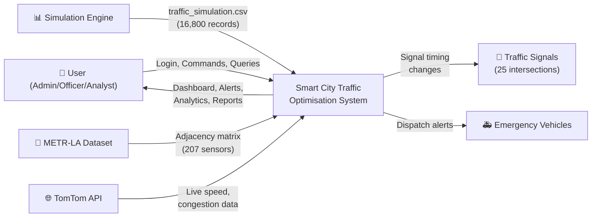
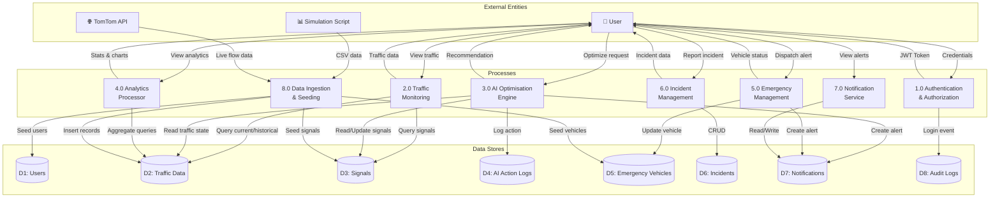
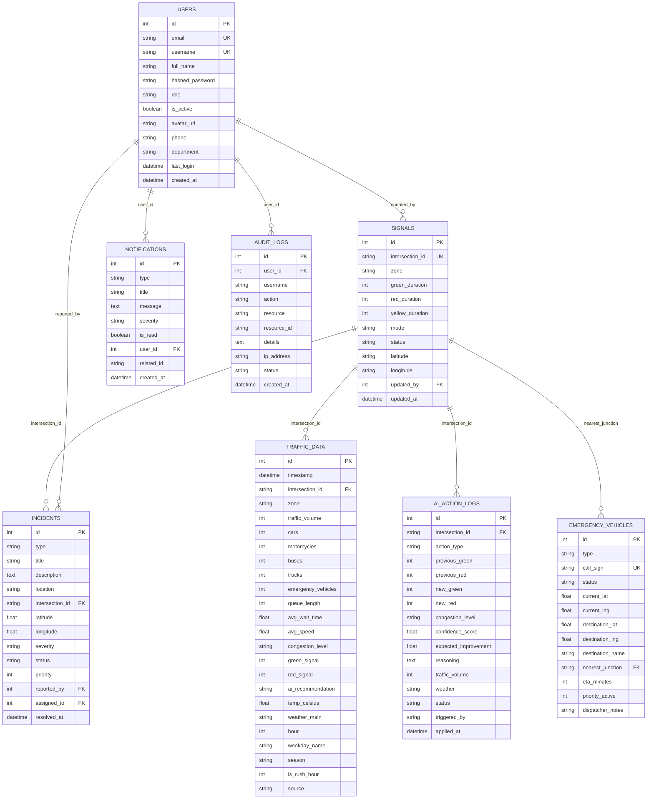
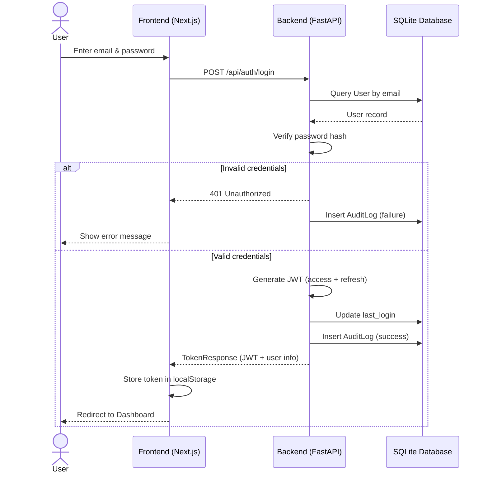
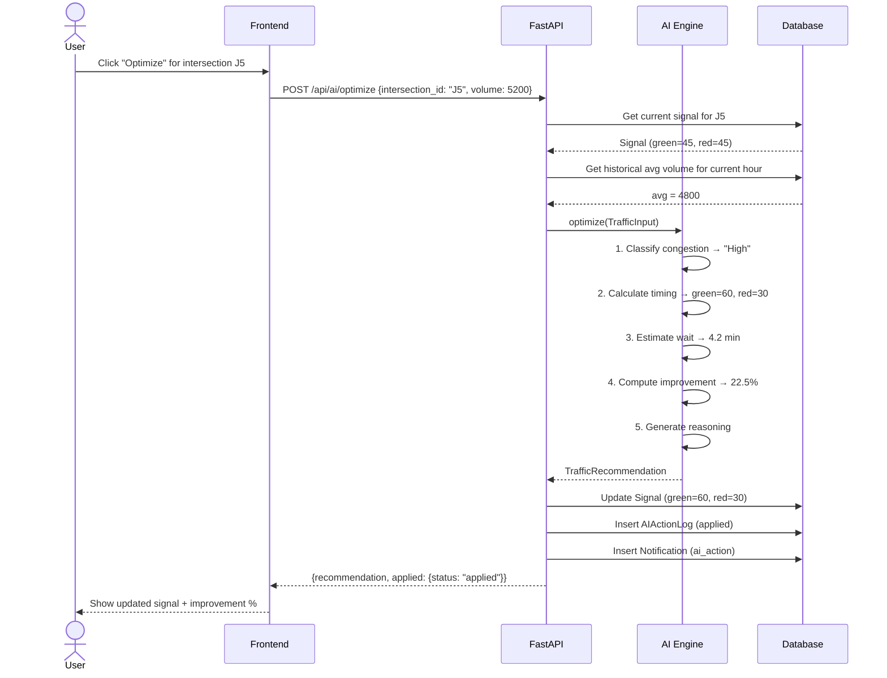
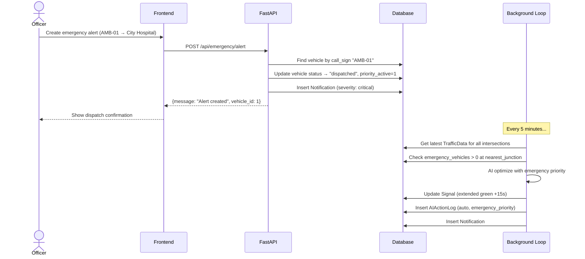
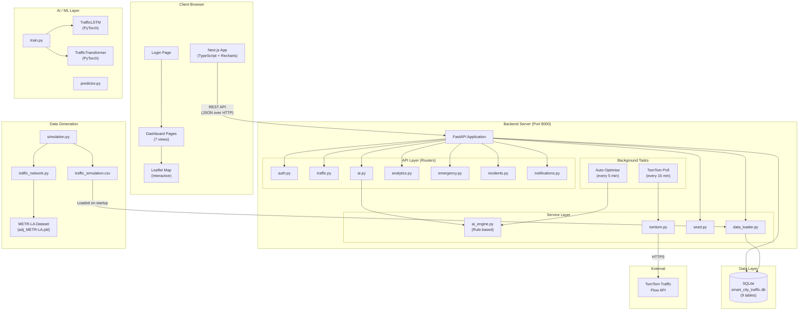
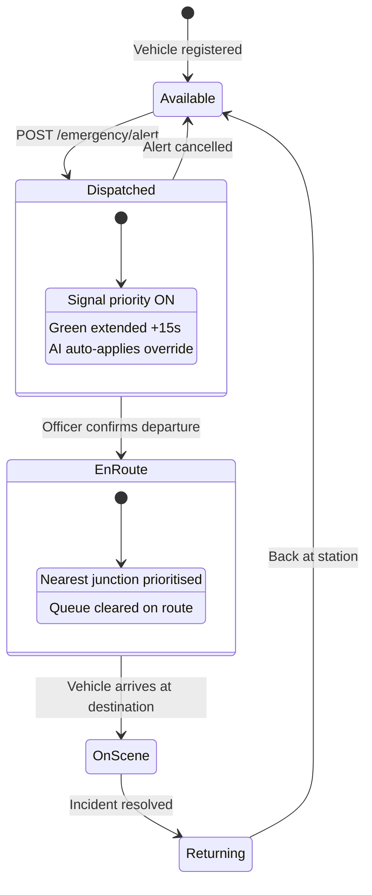
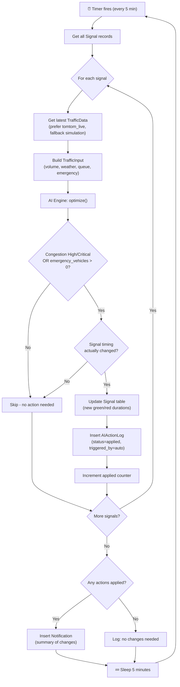

# 🚦 Smart City Traffic Optimisation System — Project Documentation

---

## 1. What Is This Project?

The **Smart City Traffic Optimisation System** is an AI-powered web platform that monitors, analyses, and optimises urban traffic flow across a simulated 25-intersection city grid. It provides a real-time dashboard for traffic operators to visualise congestion, manage incidents, prioritise emergency vehicles, and let an AI engine automatically adjust traffic signal timings — all from a single interface.

**Key capabilities at a glance:**

| Feature | Description |
|---|---|
| Real-time monitoring | Live traffic volume, speed, congestion level, and queue length per intersection |
| AI signal optimisation | Rule-based engine auto-adjusts green/red signal durations based on congestion, weather, zone, and emergencies |
| Emergency vehicle priority | Dispatches and tracks emergency vehicles; automatically extends green signals on their route |
| Analytics dashboard | Hourly patterns, congestion distribution, weather impact, heatmaps, and historical trends |
| Incident management | Log, track, and resolve traffic incidents (accidents, road works, special events) |
| Notification system | Real-time alerts for AI actions, emergencies, system health, and anomalies |
| LSTM/Transformer models | Deep learning models (PyTorch) for traffic volume prediction and optimal signal timing |
| Traffic simulation | 7-day synthetic traffic generator using METR-LA network topology |

---

## 2. Why Was It Built?

Urban traffic congestion is one of the costliest problems facing modern cities — wasted fuel, increased emissions, delayed emergency response, and reduced quality of life.

This project was built as a **Xebia internship project** to demonstrate how AI and data-driven approaches can:

- **Reduce congestion** by dynamically adjusting signal timings instead of using fixed schedules.
- **Prioritise emergency vehicles** by overriding signals to clear their path.
- **Provide actionable insights** to traffic operators through rich analytics.
- **Simulate realistic scenarios** (weather, incidents, rush hours) for testing optimisation strategies before real-world deployment.

It serves as both a **functional prototype** and a **learning platform** for smart city infrastructure.

---

## 3. How Does It Work?

### 3.1 Architecture Overview

```
┌─────────────────────────────────────────────────────────┐
│                     Frontend (Next.js)                  │
│   Dashboard │ Traffic │ Analytics │ Emergency │ AI      │
│   Login/Auth │ Map View │ Incidents │ Notifications     │
└────────────────────────┬────────────────────────────────┘
                         │ HTTP REST (JSON)
┌────────────────────────┴────────────────────────────────┐
│                    Backend (FastAPI)                     │
│  Routers: auth, traffic, ai, analytics, emergency,      │
│           incidents, notifications                       │
│  Services: ai_engine, data_loader, seed, tomtom         │
│  Database: SQLite via SQLAlchemy                         │
│  Background: auto-optimise loop (5 min), TomTom poll     │
└────────────────────────┬────────────────────────────────┘
                         │
         ┌───────────────┼───────────────┐
         │               │               │
   ┌─────┴─────┐  ┌──────┴─────┐  ┌─────┴──────┐
   │ Simulation │  │  AI Engine  │  │  METR-LA   │
   │  (Python)  │  │(Rule-based +│  │  Dataset   │
   │ 7-day CSV  │  │  LSTM/TF)  │  │ (207 nodes)│
   └───────────┘  └────────────┘  └────────────┘
```

### 3.2 Data Pipeline

1. **Simulation** → `simulation.py` generates a 7-day traffic dataset across 25 intersections (a 5×5 grid mapped to METR-LA topology). It produces ~16,800 records with 28+ columns including volume, speed, queue length, weather, incidents, emissions, and Level of Service.

2. **Data loading** → On backend startup, `data_loader.py` ingests the simulation CSV and any METR-LA CSV into the SQLite database, tagged by `source` (simulation, metro).

3. **Live data (optional)** → A background loop polls the **TomTom Traffic Flow API** every 15 minutes for real-time speed/congestion data at each intersection's coordinates.

4. **Seeding** → `seed.py` populates the database with 25 signal configurations, 15 emergency vehicles, sample incidents, notifications, and demo users (admin + officer).

### 3.3 AI Optimisation Engine

The core engine ([ai_engine.py](file:///d:/University/Xebia%20Internship(3rd%20year)/Smart%20City%20Traffic%20Optimisation%20System/backend/app/services/ai_engine.py)) is a **rule-based system** designed for easy future replacement with ML models:

```
Input                          → Processing                    → Output
─────                            ──────────                      ──────
traffic_volume                   1. Classify congestion          congestion_level
weather                          2. Calculate signal timing      suggested_green
hour, is_rush_hour               3. Estimate wait time           suggested_red
emergency_vehicles               4. Calculate improvement %      expected_improvement
zone (Hospital/School/etc.)      5. Compute confidence score     confidence_score
current_green, current_red       6. Generate reasoning text      reasoning, priority
queue_length                                                     action
```

**Key rules:**
- Weather factors increase effective volume (Rain ×1.25, Snow ×1.45, Thunderstorm ×1.50).
- Zone weights boost priority (Hospital ×1.3, School ×1.2).
- Emergency vehicles add +15 seconds green per vehicle.
- Rush hour detection (7–10 AM, 4–8 PM) extends green by 10 seconds.

**Auto-optimisation loop**: Every 5 minutes, a background task scans all intersections. If congestion is High/Critical or an emergency vehicle is present, it auto-applies the AI recommendation and logs the action.

### 3.4 Deep Learning Models

The [ai_engine/](file:///d:/University/Xebia%20Internship(3rd%20year)/Smart%20City%20Traffic%20Optimisation%20System/ai_engine) directory contains two PyTorch models:

| Model | Architecture | Purpose |
|---|---|---|
| `TrafficLSTM` | 2-layer LSTM → 5 prediction heads | Predicts volume, congestion class, speed, optimal green time, and wait time from sequential traffic data |
| `TrafficTransformer` | 2-layer Transformer Encoder → 5 heads | Alternative with better long-range temporal dependency capture |

Both models take input shape `(batch, seq_len, 12 features)` and output multi-task predictions. Training pipeline is in [train.py](file:///d:/University/Xebia%20Internship(3rd%20year)/Smart%20City%20Traffic%20Optimisation%20System/ai_engine/train.py), inference in [predictor.py](file:///d:/University/Xebia%20Internship(3rd%20year)/Smart%20City%20Traffic%20Optimisation%20System/ai_engine/predictor.py).

### 3.5 Backend API

All API routes require JWT authentication (except login/register). Key endpoint groups:

| Router | Prefix | Key Endpoints |
|---|---|---|
| **Auth** | `/api/auth` | `POST /login`, `POST /register`, `GET /me`, `PUT /profile`, `PUT /change-password` |
| **Traffic** | `/api/traffic` | `GET /current`, `GET /historical`, `GET /heatmap`, `GET /intersections` |
| **AI** | `/api/ai` | `POST /optimize`, `POST /auto-optimize-all`, `GET /action-log`, `POST /revert/{id}`, `GET /predictions` |
| **Analytics** | `/api/analytics` | Summary stats, hourly/zone breakdowns, weather impact |
| **Emergency** | `/api/emergency` | `GET /vehicles`, `POST /alert`, `PUT /priority/{id}`, `GET /dashboard` |
| **Incidents** | `/api/incidents` | CRUD for traffic incidents |
| **Notifications** | `/api/notifications` | List, mark read, bulk operations |

### 3.6 Frontend Dashboard

Built with **Next.js + TypeScript + Recharts**, the dashboard has 7 main pages:

| Page | What It Shows |
|---|---|
| **Dashboard Overview** | KPI cards (volume, speed, wait time), hourly bar chart, congestion pie chart, interactive map, recent alerts |
| **Traffic Monitoring** | Current intersection status, live congestion data, signal states |
| **Analytics** | Historical trends, heatmaps, zone-wise and weather-impact analysis |
| **AI Optimization** | Run manual optimisations, view action log, revert changes, auto-optimise all |
| **Emergency** | Vehicle fleet status, dispatch alerts, priority signal activation |
| **Incidents** | Report/track accidents, road works, and special events |
| **Notifications** | All system alerts with severity filtering |

### 3.7 Authentication & Roles

| Role | Access |
|---|---|
| `admin` | Full access — manage users, run bulk AI optimisations, view all logs |
| `officer` | Operational access — monitor traffic, dispatch emergencies, manage incidents |
| `analyst` | Read-only analytics and traffic data |

**Demo credentials:**
- Admin: `admin@smartcity.com` / `Admin@123`
- Officer: `officer@smartcity.com` / `Officer@123`

---

## 4. How to Use It

### 4.1 Prerequisites

- **Node.js** v18+
- **Python** 3.10+
- **Docker** (optional, for containerised deployment)

### 4.2 Quick Start

**Backend:**
```bash
cd backend
python -m venv venv
venv\Scripts\activate          # Windows
pip install -r requirements.txt
uvicorn main:app --reload --port 8000
```
→ API docs at `http://localhost:8000/docs`

**Frontend:**
```bash
cd frontend
npm install
npm run dev
```
→ Dashboard at `http://localhost:3000`

**Docker (one command):**
```bash
docker-compose up --build
```

### 4.3 Running the Traffic Simulation

```bash
python simulation.py
```
Generates `traffic_simulation.csv` — a 7-day dataset with ~16,800 rows across 25 intersections.

### 4.4 Training the AI Model

```bash
cd ai_engine
python train.py
```
Trains the LSTM/Transformer on the simulation data and saves model weights.

### 4.5 Environment Variables

Create a `backend/.env` file:
```env
SECRET_KEY=your-secret-key
DATABASE_URL=sqlite:///./smart_city_traffic.db
CORS_ORIGINS=http://localhost:3000
TOMTOM_API_KEY=your_tomtom_api_key_here   # optional, for live traffic
```

---

## 5. How to Maintain It

### 5.1 Database

- **Engine**: SQLite (file: `backend/smart_city_traffic.db`). Zero configuration, but switch to PostgreSQL for production by changing `DATABASE_URL`.
- **Schema**: Auto-created on startup via SQLAlchemy's `create_tables()`. Models live in `backend/app/models/`.
- **Seeding**: On every startup, `seed.py` checks and populates default data (signals, vehicles, users) if empty.

### 5.2 Key Files to Know

| File | Purpose |
|---|---|
| `backend/main.py` | App entry point, startup lifecycle, background loops |
| `backend/app/services/ai_engine.py` | The AI optimisation logic — modify rules here |
| `backend/app/services/data_loader.py` | CSV ingestion pipeline |
| `backend/app/services/seed.py` | Default data seeding |
| `simulation.py` | Traffic data generator |
| `traffic_network.py` | City grid topology and METR-LA graph utilities |
| `frontend/src/lib/api.ts` | All frontend API calls |
| `frontend/src/app/globals.css` | Global styles and design system |

### 5.3 Monitoring

- **Health check**: `GET /health` returns system status.
- **AI health**: `GET /api/ai/health` returns engine status, data availability, and model metrics.
- **Auto-optimisation status**: `GET /api/ai/auto-status` shows today's applied/skipped actions and average improvement.
- **Logs**: Backend logs to stdout with timestamps via Python's `logging` module.

---

## 6. How to Extend It

### 6.1 Replace the Rule-Based Engine with ML

The AI engine uses a **Strategy Pattern** — swap the rule-based logic with the trained LSTM/Transformer:

1. Train a model: `python ai_engine/train.py`
2. In `backend/app/services/ai_engine.py`, replace the `optimize()` method to load the PyTorch model and run inference instead of rule-based logic.
3. The `TrafficInput` → `TrafficRecommendation` interface stays the same.

### 6.2 Add a New Intersection Zone

1. Update `ZONE_MAP` in [traffic_network.py](file:///d:/University/Xebia%20Internship(3rd%20year)/Smart%20City%20Traffic%20Optimisation%20System/traffic_network.py)
2. Add zone-specific traffic profiles in `simulation.py` (`get_base_volume`, `get_vehicle_distribution`, `get_traffic_multiplier`)
3. Add zone weight in `ai_engine.py` → `ZONE_WEIGHTS`
4. Update `seed.py` to include signals for new intersections

### 6.3 Integrate Real Traffic Data

- **TomTom API**: Already integrated — set `TOMTOM_API_KEY` in `.env`. The background loop polls every 15 minutes.
- **Other APIs**: Add a new service in `backend/app/services/`, create a background loop in `main.py`, and write data to the `TrafficData` model with a new `source` tag.

### 6.4 Add a New Dashboard Page

1. Create a new directory under `frontend/src/app/dashboard/<page-name>/`
2. Add a `page.tsx` file with your component
3. Add a navigation link in `frontend/src/app/dashboard/layout.tsx`
4. Create API endpoints if needed in `backend/app/routers/`

### 6.5 Add a New API Router

1. Create a new file in `backend/app/routers/`
2. Define a `router = APIRouter(prefix="/api/<name>", tags=["<Name>"])`
3. Register it in `backend/main.py` with `app.include_router(your_router.router)`

### 6.6 Tableau Dashboard

The project includes a Tableau workbook (`City Traffic Optimisation System Dashboard.twb`) for advanced visual analytics. Connect it to the exported simulation CSV or directly to the SQLite database.

---

## 7. Project Structure Summary

```
Smart City Traffic Optimisation System/
├── frontend/                        # Next.js dashboard
│   └── src/app/
│       ├── page.tsx                 # Login page
│       └── dashboard/
│           ├── page.tsx             # Overview dashboard
│           ├── traffic/             # Traffic monitoring
│           ├── analytics/           # Analytics & trends
│           ├── ai-optimization/     # AI control panel
│           ├── emergency/           # Emergency dispatch
│           ├── incidents/           # Incident management
│           ├── notifications/       # Alert centre
│           └── settings/            # User settings
├── backend/                         # FastAPI server
│   ├── main.py                      # Entry point + background loops
│   └── app/
│       ├── routers/                 # API endpoints (7 routers)
│       ├── models/                  # SQLAlchemy ORM models (10 tables)
│       ├── services/                # Business logic (AI, data, seeding)
│       └── core/                    # Config, DB, auth, security
├── ai_engine/                       # PyTorch LSTM + Transformer models
│   ├── model.py                     # Model architectures
│   ├── train.py                     # Training pipeline
│   └── predictor.py                 # Inference wrapper
├── simulation.py                    # 7-day traffic data generator
├── traffic_network.py               # METR-LA graph + city grid topology
├── docker-compose.yml               # One-command deployment
└── Dataset/                         # METR-LA adjacency data
```

---

## 8. System Diagrams

### 8.1 Use Case Diagram

Shows all actors and their interactions with the system.

```mermaid
graph TB
    subgraph Actors
        A["🧑‍💼 Admin"]
        O["👮 Officer"]
        AN["📊 Analyst"]
        SYS["⚙️ System / Background"]
        TOM["🌐 TomTom API"]
    end

    subgraph "Smart City Traffic Optimisation System"
        UC1["Login / Register"]
        UC2["View Dashboard Overview"]
        UC3["Monitor Real-Time Traffic"]
        UC4["View Analytics & Trends"]
        UC5["Run AI Signal Optimisation"]
        UC6["Auto-Optimise All Intersections"]
        UC7["View / Revert AI Action Log"]
        UC8["Dispatch Emergency Vehicle"]
        UC9["Toggle Signal Priority"]
        UC10["Report / Manage Incidents"]
        UC11["View / Manage Notifications"]
        UC12["Manage User Profile"]
        UC13["Seed Default Data"]
        UC14["Auto-Optimise Loop - 5 min"]
        UC15["Poll Live Traffic - 15 min"]
        UC16["Provide Live Traffic Flow"]
    end

    A --> UC1 & UC2 & UC3 & UC4 & UC5 & UC6 & UC7 & UC8 & UC9 & UC10 & UC11 & UC12
    O --> UC1 & UC2 & UC3 & UC4 & UC5 & UC8 & UC9 & UC10 & UC11 & UC12
    AN --> UC1 & UC2 & UC3 & UC4 & UC11 & UC12
    SYS --> UC13 & UC14 & UC15
    TOM --> UC16
    UC15 --> UC16
```



---

### 8.2 Data Flow Diagram — Level 0 (Context)

High-level view showing external entities and the system boundary.



---

### 8.3 Data Flow Diagram — Level 1 (Detailed)

Shows internal processes and data stores.



---

### 8.4 Entity Relationship Diagram

Complete database schema with all 9 tables and their relationships.



---

### 8.5 Sequence Diagram — User Login Flow



---

### 8.6 Sequence Diagram — AI Signal Optimisation



---

### 8.7 Sequence Diagram — Emergency Vehicle Dispatch



---

### 8.8 Component / Deployment Diagram



---

### 8.9 State Diagram — Emergency Vehicle Lifecycle



---

### 8.10 Activity Diagram — Auto-Optimisation Background Loop



---

> **In short**: This is a full-stack smart city prototype that simulates realistic traffic, uses AI to optimise signal timings in real-time, and presents everything through an interactive dashboard — ready to be extended with real sensors, ML models, and production databases.
